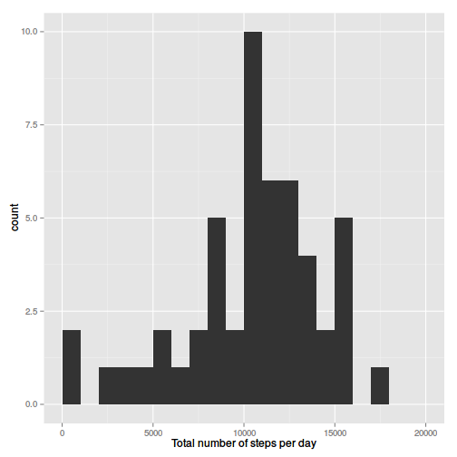
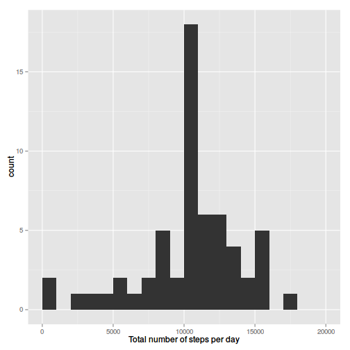

# Reproducible Research: Peer Assessment 1


## Loading and preprocessing the data

This code loads the csv file:

```r
data <- read.csv("activity.csv")
```


## What is mean total number of steps taken per day?

First we calculate the total number of steps per day ignoring the NA values:

```r
spd <- sapply(split(data$steps, data$date, drop = TRUE), sum)
```


Now the histogram is drawn using the ggplot2 library, the frequency is calculated
for intervals of 1000 steps:

```r
library(ggplot2)
qplot(spd, xlab = "Total number of steps per day", breaks = seq(0, 20000, by = 1000))
```

 


This code calculates the mean and the median for the daily totals:

```r
mean.spd <- format(mean(spd, na.rm = TRUE), scientific = FALSE)
median.spd <- format(median(spd, na.rm = TRUE), scientific = FALSE)
```


The mean for the total number of steps is 10766 steps and the median
is 10765 steps.


## What is the average daily activity pattern?

This is the calculation of the averages by interval:


```r
avg.interval <- sapply(split(data$steps, data$interval), function(x) {
    mean(x, na.rm = TRUE)
})

time.max.avg <- names(sort(avg.interval, decreasing = TRUE)[1])
max.avg <- sort(avg.interval, decreasing = TRUE)[[1]]
```


The plot of averages by interval:

```r
plot(names(avg.interval), avg.interval, type = "l", xlab = "Time interval", 
    ylab = "steps")
```

 


The maximum average number of steps occur at 835 with 206.1698 steps.

## Imputing missing values

Total number of missing values:

```r
total.na <- length(which(is.na(data)))

record.mean <- mean(data$steps, na.rm = TRUE)
```


1. There are 2304 records with missing values.

2. The strategy will be to replace these NA values with the average number of 
  steps (37.3826)

3. The new dataset will be called **data.wo.na**

4. Now we plot the same histogram on the modified data:


```r
data.wo.na <- data
data.wo.na$steps[which(is.na(data.wo.na$steps))] <- record.mean
```


```r
spd.wo.na <- sapply(split(data.wo.na$steps, data.wo.na$date, drop = TRUE), sum)
qplot(spd.wo.na, xlab = "Total number of steps per day", breaks = seq(0, 20000, 
    by = 1000))
```

 

```r
mean.spd.wo.na <- format(mean(spd.wo.na), scientific = FALSE)
median.spd.wo.na <- format(median(spd.wo.na), scientific = FALSE)
```


The mean for the total number of steps was 10766 steps, now it is 
still 10766.  The median was 10765 steps after 
replacing the NA values it becomes 10766.


## Are there differences in activity patterns between weekdays and weekends?


